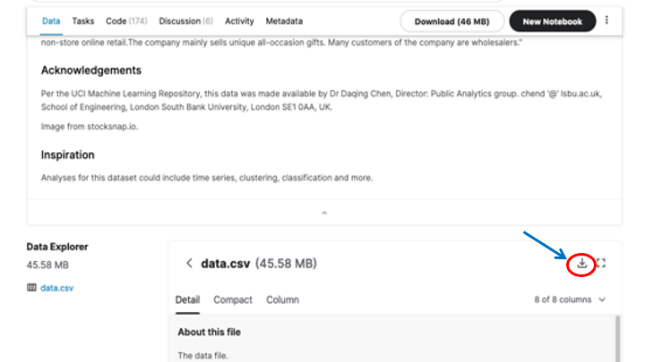

**Analytics Workshop - Fintech Forum, 2021**

1. One of the key aspects of effectively personalizing the customer's experience is the ability to flawlessly and frictionlessly presenting customers hyper-relevant offers. [Research by Accenture and Nomis](https://www.accenture.com/_acnmedia/accenture/conversion-assets/dotcom/documents/global/pdf/dualpub_20/accenture-retail-bank-pricing-survey.pdf) suggests that fintechs that link pricing to customer lifetime value (CLV) will be better positioned for growth and prosperity.
2. One of the most important processes in determining CLV is the ability to segment your customers. Recency, Frequency, Monetary (RFM) segmentation enables personalized marketing, increases engagement, and enables you to create specific, relevant offers for the right groups of customers. 
3. We will be performing RFM analysis, the approach can be leveraged in banking, especially mobile banking where customers often also engage with merchants through the bank's mobile app, typical inputs to such an analysis may include deposit type, transaction date, balance before transaction, transaction amount etc.. It can also be leveraged with insurance where the input data may include demographic details, term of policy, sum assured, premium, agent etc. [This is a paper that covers various techniques in depth](https://farapaper.com/wp-content/uploads/2019/06/Fardapaper-Customers-Segmentation-in-the-Insurance-Company-TIC-Dataset.pdf).
4. We will be using [this dataset](https://www.kaggle.com/olistbr/brazilian-ecommerce) for the lab. This dataset should serve as an analogy for transactions in banking, insurance, and other fintechs.
5. Download the dataset by clicking on [this link](https://www.kaggle.com/olistbr/brazilian-ecommerce), use the download button. 
    
6. On your browser, navigate to your lab environment's AWS Management Console, next, navigate to the the IAM console and on the left-handside panel click on __Roles__. In the right-hand side panel search for __TeamRole__. Once you find the TeamRole, click to see the details, make a note of the ARN of the role.
7. Run the following commands,
```
git clone https://OmarKhayyam/ff-analytics-ws.git
``` 
Next, initiate the stack creation for the lab,

```
aws cloudformation create-stack --stack-name step-1-stack --template-body file://Step-First.yml --parameters ParameterKey=TeamRoleArn,ParameterValue=<ARN of the IAM role TeamRole from step 6> --capabilities CAPABILITY_IAM
```
8. Either upload the downloaded dataset file using the S3 console to the bucket we just created or run the following command,
```
aws s3 cp <location of dataset file> s3://<bucket-name>[/<optional prefix>]
```
Upload the following files to the S3 bucket,
```
olist_customers_dataset.csv
olist_orders_dataset.csv
olist_order_payments_dataset.csv
```
Look at the __Outputs__ of the above created stack to get the bucket name. You can choose the prefix if you like. 

9. Go to the Amazon Redshift management console. From the left-handside panel click on __EDITOR__. Choose to use __Query Editor__ and __NOT__ the __Query Editor V2__.
10. In the Query Editor, click the __Connect to database__ button on the right. In the pop up, choose __Create a new connection__, for Authentication choose __Temporary credentials__. Choose your cluster from the cluster drop-down, enter the database name __workshopredshiftdb__. For user enter __admin__. You should now be connected to the database.
11. Create tables by issuing the following CREATE TABLE commands in the Query Editor,
```
create table if not exists customers_1(
customer_id varchar(40) not null,
customer_unique_id varchar(40) not null,
zip_code char(5),
customer_city varchar(100),
state varchar(3) not null,
primary key(customer_id))
distkey(customer_id)
```
```
create table if not exists orders_1(
order_id varchar(40) not null,
customer_id varchar(40) not null,
order_status varchar(15) not null,
order_purchase_time timestamp not null,
order_approved_at timestamp,
order_delivered_carrier_date timestamp,
order_delivered_customer_date timestamp,
order_estimated_delivery_date timestamp,
primary key(customer_id))
distkey(customer_id)
```
```
create table if not exists payments_1(
order_id varchar(40) not null,
payment_sequential integer,
payment_type varchar(15),
payment_installments integer,
payment_value NUMERIC(10,4),
primary key(order_id))
distkey(order_id)
```

11. Load the data from S3 into a Redshift table using the following COPY commands,
```
copy customers_1 from 's3://<Bucket-Name>/olist_customers_dataset.csv' IGNOREHEADER 1 MAXERROR 10 iam_role '<IAM Role from the Outputs tab in Cloudformation console>' csv;
```
```
copy orders_1 from 's3://<Bucket-Name>/olist_orders_dataset.csv' IGNOREHEADER 1 MAXERROR 10 iam_role '<IAM Role from the Outputs tab in Cloudformation console>' csv;
```
```
copy payments_1 from 's3://<Bucket-Name>/olist_order_payments_dataset.csv' IGNOREHEADER 1 MAXERROR 10 iam_role '<IAM Role from the Outputs tab in Cloudformation console>' csv;
```
12.